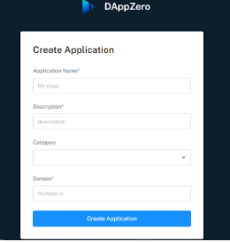
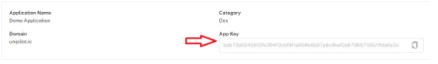

# Spock Analytics 
Spock offers an extensive dataset for dApps, enabling product creators to identify and analyze critical pain points across multiple data sets. These data sets include both off-chain and real-time on-chain metrics, providing product creators with a complete picture of the product experience on both sides of the dApps.

# Get Started 
To get started with Spock Analytics, follow these steps:

1. Sign up on [https://spockanalytics.xyz/] through Web3 Wallets, Gmail, Twitter, or Magic link.
2. Once you have signed up, create an application on either the Ethereum, Polygon, or BSC mainnet or testnet chain.

# Integrations & Onboarding 
To fully onboard on Spock Analytics, there are two steps that must be completed.

1.Javascript SDK Integration:

 You can use the Spock Javascript library to keep track of the off-chain data in your dApp. It's easy to install as an NPM package and will give you valuable insights into how your dApp is performing. 
 

 

    
    

a. Once you created application you will get `appKey` from configuration page.

    

    
    

  
b. Install the Spock Analytics published [analytics-web3] [https://www.npmjs.com/package/analytics-web3] package from npm.
  
c. Integrate sdk on your DApp with the help of [analytics-web3-API](https://www.npmjs.com/package/analytics-web3#api) and you can also go through the [demo-code](https://github.com/xorddotcom/DAppzero-Analytics-Demo)
 
Source :( https://spock-analytics.gitbook.io/spock-analytics-docs/adapter/adapter)
 
2.Code Adapter
 
Spock adapters are using two approaches for transforming raw on-chain data. One is the transformers which are used to track contribution (USD value moving inside the protocol) and extraction (USD value coming out from protocol), and the other one is TVL extractors that are responsible to calculate the asset in terms of USD locked in a protocol.
 
Source : (https://spock-analytics.gitbook.io/spock-analytics-docs/adapter/adapter)

## Examples
 - [React](https://github.com/xorddotcom/spock-analytics-demo/tree/main/react)
